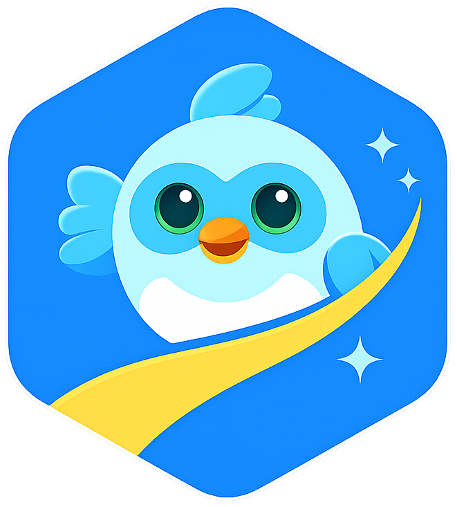

<table border="0">
  <tr>
    <td>
       
    </td>
    <td>
      <h1>Flutter Quest</h1>
      <p>Flutter Quest is a gamified educational app to learn Dart and Flutter through routes, nodes, interactive lessons, and daily challenges.</p>
      <p>Flutter Quest es una app educativa gamificada para aprender Dart y Flutter mediante rutas, nodos, lecciones interactivas y retos diarios.</p>
    </td>
  </tr>
</table>

## Project Vision / Visión

**EN**
- Build a premium learning experience focused on practical progression.
- Teach by short theory + practice + feedback.
- Keep progress meaningful through XP, badges, streak, and route completion.
- Add a lightweight daily ritual through a timed challenge and recent challenge history.

**ES**
- Construir una experiencia de aprendizaje premium con progresión práctica.
- Enseñar con teoría corta + práctica + feedback.
- Hacer que el progreso importe con XP, insignias, racha y cierre de rutas.
- Añadir un hábito diario liviano mediante un reto contrarreloj y un historial reciente de retos.

## Architecture / Arquitectura

### Technical Stack
- Flutter (mobile + web)
- Riverpod (single source of truth for app state)
- GoRouter (declarative navigation)
- Local JSON content (routes, nodes, activities)
- SharedPreferences (local progress persistence)
- Supabase (daily challenges feed)
- flutter_local_notifications (habit reminders)
- flutter_dotenv (`.env` based local configuration)

### State Boundaries
- **Content State**: routes and lessons loaded from JSON assets.
- **Progress State**: XP, completed nodes/routes, streak, badges, user preferences.
- **Lesson Session State**: temporary lesson runtime state (current step, answers, validation).
- **Daily Challenge State**: current timed challenge, recent 7-day backlog, and completion history.

### Content Contract
- All activity schemas are defined in:
  - [`activity_contracts.md`](docs/content/activity_contracts.md)
- New route JSON must comply with this contract.

### Route Release Model
- Flutter Quest can contain multiple route JSON files in the repository.
- Public releases do **not** expose every route at once.
- The app publishes routes progressively:
  - current live route(s),
  - one visible `Coming soon` teaser,
  - the rest remain hidden until a future release window.
- Release visibility is controlled in:
  - [`app_state_providers.dart`](lib/features/learning/state/app_state_providers.dart)
  - `routeReleasePlanProvider`

This keeps the public app focused while content is reviewed route by route.

### Daily Challenge Model / Modelo de retos diarios
- The `Challenges` tab loads the current daily challenge from Supabase.
- The challenge is always multiple choice, timed to 30 seconds, and supports an optional code snippet.
- The “day” is resolved using the **device local date**, not UTC.
- Below the main card, the app shows the last 7 previous challenges:
  - unresolved past challenges can still be solved,
  - correctly solved past challenges stay marked as completed,
  - failed past challenges stay marked as `Not achieved` / `No logrado`,
  - past challenges do **not** grant XP,
  - only the current day challenge grants XP.
- Recent challenges are opened using the already loaded payload first, with Supabase fetch as fallback.
- Challenge fetches use timeout + retry states to avoid infinite loading.
- Daily challenge completion is persisted locally by publish date so the same challenge cannot be replayed for rewards.

## How To Run / Cómo correr

### Prerequisites
- Flutter SDK (stable)
- Dart SDK (bundled with Flutter)

### Commands
```bash
flutter pub get
flutter run
```

Optional checks:
```bash
flutter analyze
```

### Daily Challenge Environment / Entorno del reto diario

Daily challenges are optional in local development. If `.env` is missing, the rest of the app still works and the `Challenges` tab falls back gracefully.

Create a local `.env` from the example:

```bash
cp .env.example .env
```

Available keys:

```env
SUPABASE_URL=
SUPABASE_PUBLISHABLE_KEY=
SUPABASE_DAILY_CHALLENGE_TABLE=daily_questions
```

## Add a New Route / Cómo agregar una nueva ruta

1. Create the JSON file in `assets/content/`.
2. Follow the schema from:
   - [`activity_contracts.md`](docs/content/activity_contracts.md)
   - [`estructura_json_nueva_ruta.md`](docs/estructura_json_nueva_ruta.md)
3. Register the route manifest in:
   - [`app_state_providers.dart`](lib/features/learning/state/app_state_providers.dart)
   - `routeManifestsProvider`
4. Place the route in the correct order inside `routeManifestsProvider`.
5. If needed, define unlock dependency (`requiredCompletedRouteId`).
6. Decide whether the route should be:
   - already public,
   - the single visible teaser,
   - or still hidden for a later monthly release.
7. Update `routeReleasePlanProvider` only when the route is truly ready for public exposure.
8. Run the app and verify route rendering and lesson flow.

## Daily Challenges / Retos diarios

The daily challenge feed is **not** authored through route JSON.

- Source: Supabase table defined by `SUPABASE_DAILY_CHALLENGE_TABLE`
- Current contract:
  - localized `topic`
  - localized `question`
  - optional `code_snippet`
  - localized `options` with exactly 4 entries
  - `correct_index`
  - localized `explanation`
  - `publish_date`
  - `is_active`
- UI behavior:
  - today challenge appears first,
  - recent 7-day backlog appears below,
  - old unresolved challenges are playable without XP,
  - correctly completed challenges are visibly locked from re-entry,
  - failed past challenges remain visible as `No logrado` / `Not achieved`,
  - daily visibility is based on the user's local device date.

When changing challenge behavior, update both:
- product docs,
- persistence assumptions in `LearningProgressState`.

## Open Source Model / Modelo Open Source

This project uses:
- `AGPL-3.0-only` as public open-source license [`LICENSE`](LICENSE).
- Commercial licensing options [`LICENSE-COMMERCIAL.md`](LICENSE-COMMERCIAL.md).

Any commercial usage outside AGPL obligations requires a commercial license.
Any deployment or reuse must preserve creation credit to **Dolph Hincapie**.

## Contributing / Contribuir

Please read:
- [`CONTRIBUTING.md`](CONTRIBUTING.md)
- [`CODE_OF_CONDUCT.md`](CODE_OF_CONDUCT.md)
- [`SECURITY.md`](SECURITY.md)

Main branch receives PRs directly (`main` workflow).

## Security / Seguridad

Report vulnerabilities responsibly to:
- [`dolph.hincapie26@gmail.com`](dolph.hincapie26@gmail.com)

## Maintainer

- **Dolph Hincapie**
